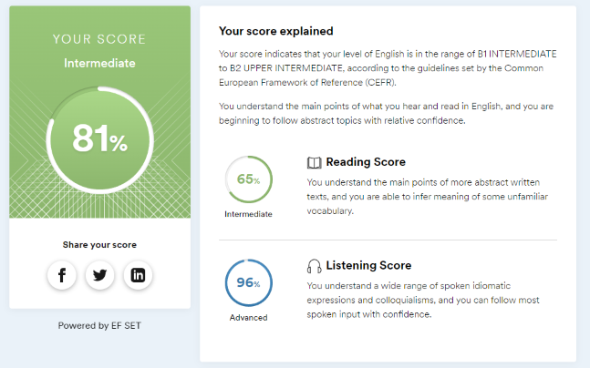

# Mark Soikin

## Junior Frontend Developer (in future)

***

## Contact information:

**Location:** Moscow, Russian Federation

**Phone:** +7(901)187-29-36

**E-mail:** sojjkin02@mail.ru

**Discord:** Loontek#4098

**Telegram:** @L0ontek

## About myself

I've been in love with computers since childhood, perhaps that's why I chose this profession.
I am studying in college in the speciality Information Systems. Now I'm learning HTML, CSS, a little JavaScript
and moving on and on. In the future I want to become a good specialist.

## Skills

* HTML5, CSS3
* Adobe PhotoShop, Illustrator, After Effects
* VS Code 
* Git, Github

# Code example

```
function multiply(a, b){
  return a * b
}
```

# Courses


* RS Schools Course «JavaScript/Front-end. Stage 0» (in progress)

# Languages 



* English Intermediate 
* Russian native
* Belorussian Basic